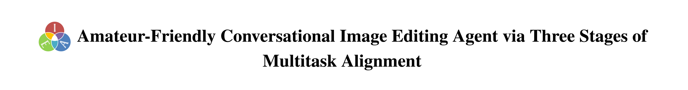

<div align="center">




**IEA: Amateur-Friendly Conversational Image Editing Agent via Three Stages of Multitask Alignment**

**CVPR 2026 Findings**

[](https://openaccess.thecvf.com/content/CVPR2026F/html/Zhu_IEA_Amateur-Friendly_Conversational_Image_Editing_Agent_via_Three_Stages_of_CVPRF_2026_paper.html)
[](https://openaccess.thecvf.com/content/CVPR2026F/html/Zhu_IEA_Amateur-Friendly_Conversational_Image_Editing_Agent_via_Three_Stages_of_CVPRF_2026_paper.html)
[](https://github.com/OpenDFM/Image_Edit_Agent)
[](https://drive.google.com/drive/folders/1UhM9DViDZkU6NyFKidIMAnF9cZoAXUha?usp=sharing)
[](https://huggingface.co/OpenDFM/Qwen2.5-VL-7B-IEA)
[](https://huggingface.co/OpenDFM/Qwen3-0.6B-IEA-RM)

</div>


## Overview

IEA is a conversational image editing agent designed to translate amateur users' natural-language requests into explicit and interpretable editing operations. Instead of directly generating a new image, IEA controls a parameterized image editor and produces a transparent editing trace that can be inspected, adjusted, and debugged.

IEA is trained with a three-stage multitask alignment pipeline:

1. **Expert-distilled supervised fine-tuning:** learn editing operations and parameters from distilled expert edits.
2. **Multitask GRPO:** optimize image likeness, tool usefulness, and intent summarization.
3. **Synthetic multitask fine-tuning:** jointly improve image editing, iterative refinement, and user-intent summarization.

The released system is based on Qwen2.5-VL-7B and supports 16 global photo-retouching tools, including exposure, contrast, highlights, shadows, saturation, temperature, sharpness, and related operations.

## Demo

[Demo Video](assets/IEA_demo_en.mp4)

## Repository Structure

```text
.
├── src/                    # Editing environment, prompts, data processing, and evaluation
├── chat_interface/         # Flask-based conversational editing demo
├── data/                   # Distilled tool calls raw data
├── datasets/               # Processed data for SFT and GRPO
├── LLaMA-Factory/          # SFT framework and IEA training configurations
└── verl/verl-0.4.1/        # GRPO framework and IEA reward implementation
```

## Installation

Python 3.11 is recommended for the lightweight editing and demo code. A CUDA-enabled Linux environment is recommended for serving the released models.

```bash
git clone https://github.com/OpenDFM/Image_Edit_Agent.git
cd Image_Edit_Agent

conda create -n iea python=3.11 -y
conda activate iea
pip install -r requirements.txt
```

Install vLLM separately according to your CUDA and PyTorch versions:

```bash
pip install vllm
```

For supervised fine-tuning, install the bundled LLaMA-Factory package:

```bash
cd LLaMA-Factory
pip install -e .
cd ..
```

For GRPO training, follow the environment instructions in [`verl/verl-0.4.1/README.md`](verl/verl-0.4.1/README.md). SFT and GRPO usually require separate environments because their optimized dependency versions may differ.

## Models

| Component | Hugging Face repository | Purpose |
| --- | --- | --- |
| IEA policy | [OpenDFM/Qwen2.5-VL-7B-IEA](https://huggingface.co/OpenDFM/Qwen2.5-VL-7B-IEA) | Editing, refinement, and intent summarization |
| IEA reward model | [OpenDFM/Qwen3-0.6B-IEA-RM](https://huggingface.co/OpenDFM/Qwen3-0.6B-IEA-RM) | Intent-summary reward used during GRPO and evaluation |

The model IDs can be passed directly to vLLM, or downloaded locally with the Hugging Face CLI:

```bash
pip install -U huggingface_hub
hf download OpenDFM/Qwen2.5-VL-7B-IEA --local-dir checkpoints/Qwen2.5-VL-7B-IEA
hf download OpenDFM/Qwen3-0.6B-IEA-RM --local-dir checkpoints/Qwen3-0.6B-IEA-RM
```

## Data

IEA is built on the [Grounded Image Editing Request (GIER)](https://sites.google.com/view/gierdataset/home) dataset and [MIT-Adobe-FiveK](https://data.csail.mit.edu/graphics/fivek/) dataset. Please download both datasets and place them in the `datasets/` directory.

The processed IEA multitask annotations and synthetic training data are available on [Google Drive](https://drive.google.com/drive/folders/1UhM9DViDZkU6NyFKidIMAnF9cZoAXUha?usp=sharing). Please download all four zips and unzip them using 7zip or winrar. The data preparation scripts expect the following layout:

```text
datasets/
├── GIER/                   # Original GIER metadata and images
├── GIER-Edit/              # Image editing and refinement data
├── GIER-Summary/           # User-intent summarization data
├── GIER-Synthesis/         # Synthetic multitask data
├── GIER_GRPO/              # Parquet files for verl
├── GIER_SFT/               # JSON files for LLaMA-Factory
└── MIT-Adobe-FiveK/        # Original MIT-Adobe-FiveK metadata and images
```

The main processing entry points are:

```text
src/prepare_gier_data.py
src/distill_GIER_data.py
src/prepare_sft_data_llamafactory.py
src/prepare_rl_data_verl.py
src/prepare_synthesis_sft_data_llamafactory.py
src/prepare_synthesis_rl_data_verl.py
```

Some preprocessing scripts retain experiment-specific path defaults. Replace them with paths for your local dataset before running the full training pipeline.

## Quick Start

Deploy the IEA policy model:

```bash
vllm serve OpenDFM/Qwen2.5-VL-7B-IEA --host 127.0.0.1 --port 18181 --api-key iea-local
```

Run the conversational demo:

```bash
python chat_interface/deploy.py --port 12345
```

Then open `http://localhost:12345`.

Optional routing, translation, and generative-editing functions in the demo use an external OpenAI-compatible multimodal API. Configure it only when needed:

```bash
export IEA_EXTERNAL_BASE_URL=https://your-api.example.com/v1/chat/completions
export IEA_EXTERNAL_API_KEY=your-api-key
export IEA_EXTERNAL_MODEL=your-multimodal-model
```

## Evaluation

After preparing the processed test data and starting the IEA server:

```bash
python -m src.eval_all \
  --model OpenDFM/Qwen2.5-VL-7B-IEA \
  --port 18181 \
  --task_type all \
  --max_workers 1
```

The evaluation code covers image editing and intent summarization. See `src/eval_all.py` for additional options.

## Training

The repository includes the training frameworks and experiment configurations used for the three-stage pipeline:

- Stage 1 and Stage 3 SFT: `LLaMA-Factory/examples/train_full/qwen2_5vl_full_sft_gier_*.yaml`
- Stage 2 GRPO: `verl/verl-0.4.1/examples/grpo_trainer/run_qwen2_5_vl-7b-*.sh`
- IEA reward: `verl/verl-0.4.1/verl/utils/reward_score/gier.py`

These configurations reproduce the research setup but still contain cluster-specific paths and resource settings. Update dataset paths, model paths, GPU counts, logging backends, and distributed-training settings for your environment.

## Acknowledgements

This codebase builds on [LLaMA-Factory](https://github.com/hiyouga/LLaMA-Factory), [verl](https://github.com/volcengine/verl), [vLLM](https://github.com/vllm-project/vllm), [Qwen2.5-VL](https://huggingface.co/Qwen/Qwen2.5-VL-7B-Instruct), and the [GIER dataset](https://sites.google.com/view/gierdataset/home).

## Citation

If you find this work useful, please cite the CVPR paper:

```bibtex
@InProceedings{Zhu_2026_CVPR,
    author    = {Zhu, Zichen and Sun, Yuheng and Zhu, Mingxuan and Ma, Wenjie and Zhang, Situo and Wang, Zhexiang and Yang, Ziyue and Zhang, Danyang and Lan, Kunyao and Zhao, Zihan and Liu, Dingye and Xiang, Siqi and Chen, Lu and Yu, Kai},
    title     = {IEA: Amateur-Friendly Conversational Image Editing Agent via Three Stages of Multitask Alignment},
    booktitle = {Proceedings of the IEEE/CVF Conference on Computer Vision and Pattern Recognition (CVPR) Findings},
    month     = {June},
    year      = {2026},
    pages     = {8672--8683}
}
```

## Contact

For questions, please open a GitHub issue or contact `JamesZhutheThird[at]sjtu.edu.cn`.
